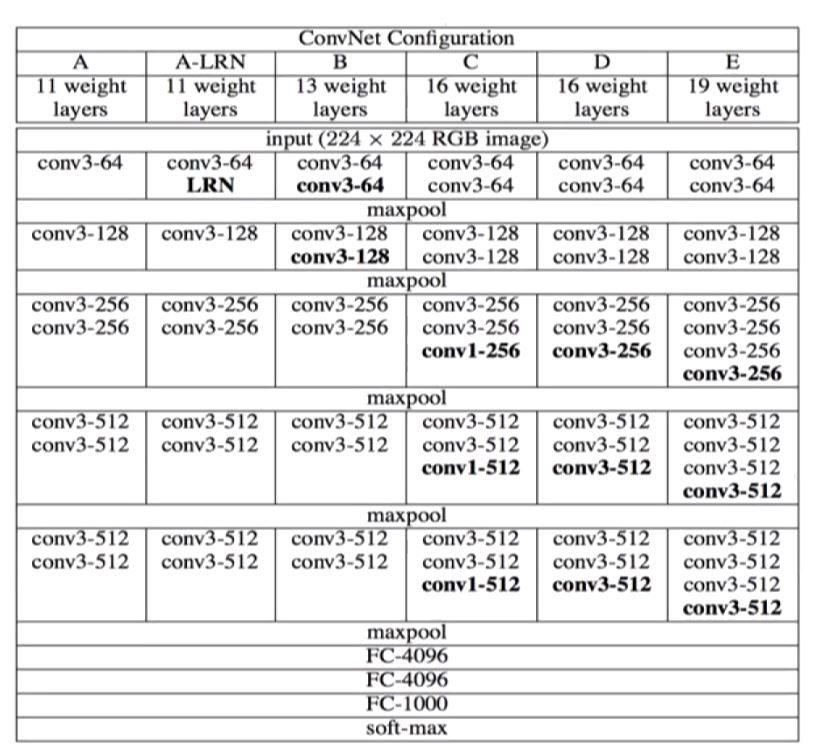

> ## 4가지 CNN 살펴보기

- 유명한 CNN or ILSVRC에서 우승을 했던 CNN 구조들: AlexNet, VGG, GoogLeNet, ResNet
- 깊어질수록 성능이 좋아질 가능성이 높다.
- [ImageNet Classification with Deep Convolutional Neural Networks](https://github.com/sjchoi86/dl_tutorials_10weeks/blob/master/papers/ImageNet%20Classification%20with%20Deep%20Convolutional%20Neural%20Networks.pdf)
- [Going deeper with convolutions](https://github.com/sjchoi86/dl_tutorials_10weeks/blob/master/papers/Going%20Deeper%20with%20Convolutions.pdf)
- [Inception-v4, Inception-ResNet and the Impact of Residual Connections on Learning](https://arxiv.org/pdf/1602.07261.pdf)

---

### AlexNet

- ILSVRC (2012)
- AlexNet의 모형이 2개로 나눠지는 가장 큰 이유는 GPU memory의 부족 때문이라고.

```
모델 구성
Conv(11 x 11 x 3 x (48 x 2)) + bias(48 x 2)
Conv(5 x 5 x 48 x (128 x 2)) + bias(128 x 2)
Conv(3 x 3 x (128 x 2) x (192 x 2)) + bias(192 x 2)
Conv(3 x 3 x 192 x (192 x 2)) + bias(192 x 2)
Conv(3 x 3 x 192 x (128 x 2)) + bias(128 x 2)
Dense(13 x 13 x (128 x 2) x (2048 x 2)) + bias(2048 x 2)
Dense((2048 x 2) x (2048 x 2) + bias(2048 x 2))
Dense((2048 x 2) x 1000 + bias(1000))
```

- Sub-sampling: Max Pooling (3 x 3)
- Activation function: ReLU (tanh보다 빠른 수렴을 보임)
- LRN (Local Response Normalization, 국소적 정규화): <i>b<sup>i</sup><sub>x, y</sub> = a<sup>i</sup><sub>x, y</sub> / (k + a * sum<sub>j = max(0, i - n/2), min(N - 1, i + n/2)</sub>(a<sup> j</sup><sub>x, y</sub>) <sup>2</sup>)<sup>beta</sup></i>, 큰 값을 갖는(활성화된) 뉴런 근처는 큰 값을 갖지 못하게 한다. 일정 부분만 높은 값을 갖게 한다.

<br />

- Regularization
  1. Data augmentation: 여러 방법을 통해 train 데이터 늘려서 이용하는 방법
     - original, little cutting, fliping(좌우반전), crop and fliping(sub) etc.
     - 하나를 2048(32(= 256 - 224) * 32 * 2(fliping))개로 늘려서 이용했다.
     - RGB에 대해선 원본 이미지의 노이즈에 대한 분포를 구하고 (or 학습하고) <i>[p1, p2, p3][a1 * lambda1, a2 * lambda2, a3 * lambda3]<sup>T</sup></i>를 이용해 부여했다.
  2. Dropout
     - 이게 Dropout에 기본적인 설명을 다 무시하고 0.5를 곱하기만 했다는 걸까
     - 아니면, 특정 비율로 dropout을 하긴 했는데, 곱하는 비율이 0.5로 고정되어 있었다는 걸까.
     - 그게 아니라면, GPU 문제로 나눈 걸 0.5를 비율로 갖는 dropout으로 확대 해석한 건가.

<br /><br /><br />

---

### VGG

공통

- 원래는 옥스포드 팀 이름이었다고
- Convolution: (3 x 3), Stride(1)
- 내부의 Convolutional weight layer의 수, 깊이, pooling의 종류 등등으로 다양하게 세분화되었다.



- 대체로 VGG-19나 VGG-16을 많이 이용한다고.

<br /><br /><br />

---

### GoogLeNet

- ILSVRC (2014)
- Google + LeNet (우편물 분류를 위한 글씨 인식)


- 22 Layers
- (Actual) Inception Module
  - 기존 (Naive) Inception는 첫번째만 (1 x 1) Conv. 이용하고, 나머지는 이용하지 않는다(4개 다 한 계층이다)
  - (1 x 1) Convolution을 이용하므로써 입력 feature map을 줄여 사용되는 parameter의 수를 줄인다.
  - 리세트 필드(?): 출력에 기본 단위(대체로 한 셀)에 영향을 주는 입력 feature map의 부분
  - Multiplity cavity: 여러 갈래로 계층을 쌓아 리세트 필드(?)를 더 넓게하는 것.
  - concatenation: 여러 방법으로 나뉜 feature map을 채널 방향으로 쌓는(더한) 것.
  - 특정한 형태의 구조를 띠므로 architecture라고 부르는 듯.
- GoogLeNet이 VGG보다 deep하지만, 이용한 parameter는 더 적다고.

추가 (- Inception-v4, Inception-ResNet and the Impact of Residual Connections on Learning)

- Inception v4 (Google): (5 x 5) filter 안 쓰자고 (3 x 3)를 2번 쓴다. 심지어 (7 x 7)를 (1 x 7)과 (7 x 1)로 분해하기도 한다.
- Inception-ResNet-v1

<br /><br /><br />

---

### ResNet

- ILSVRC (2015)<!-- 1st place on ILSVRC 2015 classification task, 1st place on ImageNet detection, 1st place on ImageNet localization, 1st place on COCO detection, Ist place on COCO segmentation -->
- Deep residual networks
- 152 Layers

> 깊어야 높은 정확도를 보일까.

1. 깊어지면서 생기는 gradient 소실
   - 깊음 + 역전파로 인한 초기 계층의 영향력이 미미하다 판단 -> 이후 계층의 영향력도 다 감소
   - better initialization methods, batch normalization, ReLU 등으로 어느 정도 무시 가능
2. Overfitting
   - no overfitting, degradation problem
   - (깊게 쌓았는데) train도 test도 잘 되는데(과적합은 안 일어나는데) 그냥 정확도(or 학습률)가 상당히 낮음.
   - Residual learning building block: 연산 전에 값을 저장했다가 두번째 (weight과 연산하고) activation function 전에 (이전 값을) 더해주는 것. (차원 맞추기)
   - 타겟과 현재 학습과의 차이만을 학습하겠다는 의미
   - 밑에 식에 shortcut 부분일 뿐.
   - 딱히 수학적, 수치적 영감이 있어서 한 건 아니고, 그냥 이렇게 하면 쉽게 학습할 것 같았다고 함.
   - (1 x 1) Conv.로 채널 수를 줄여 parameter를 줄이는데, 이후 더해야 해서 (1 x 1) Conv.를 통해 다시 채널 수를 늘여야 한다.

```Python
def conv2d(x, n_in, n_out, k, s, p="SAME", bias=False, scope="conv"):
   with tf.variable_scope(scope):
      kernel = tf.Variable(tf.truncated_normal(
         [k, k, n_in, n_out], stddev=math.sqrt(2 / (k * k * n_in))), name="weight")
      tf.add_to_collection("weights", kernel)
      conv = tf.nn.conv2d(x, kernel, [1, s, s, 1], padding=p)
      if bias:
         bias = tf.get_variable("bias", [n_out], initializer=tf.constant_initializer(0.0))
         tf.add_to_collection("biases", bias)
         conv = tf.nn.bias_add(conv, bias)
   return conv

def residual_block(x, n_in, n_out, subsample, phase_train, scope="res_block"):
   with tf.variable_scope(scope):
      if subsample:
         y = conv2d(x, n_in, n_out, 3, 2, "SAME", False, scope="conv_1")
         shortcut = conv2d(x, n_in, n_out, 3, 2, "SAME", False, scope="shortcut")
      else:
         y = conv2d(x, n_in, n_out, 3, 1, "SAME", False, scope="conv_1")
         shortcut = tf.identity(x, name="shortcut")
      
      y = batch_norm(y, n_out, phase_train, scope="bn_1")
      y = tf.nn.relu(y, name="relu_1")
      y = conv2d(y, n_out, n_out, 3, 1, "SAME", True, scope="conv_2")
      y = batchnorm(y, n_out, phase_train, scope="bn_2")
      y = tf.nn.relu(y, name="relu_2")

   return y
```
