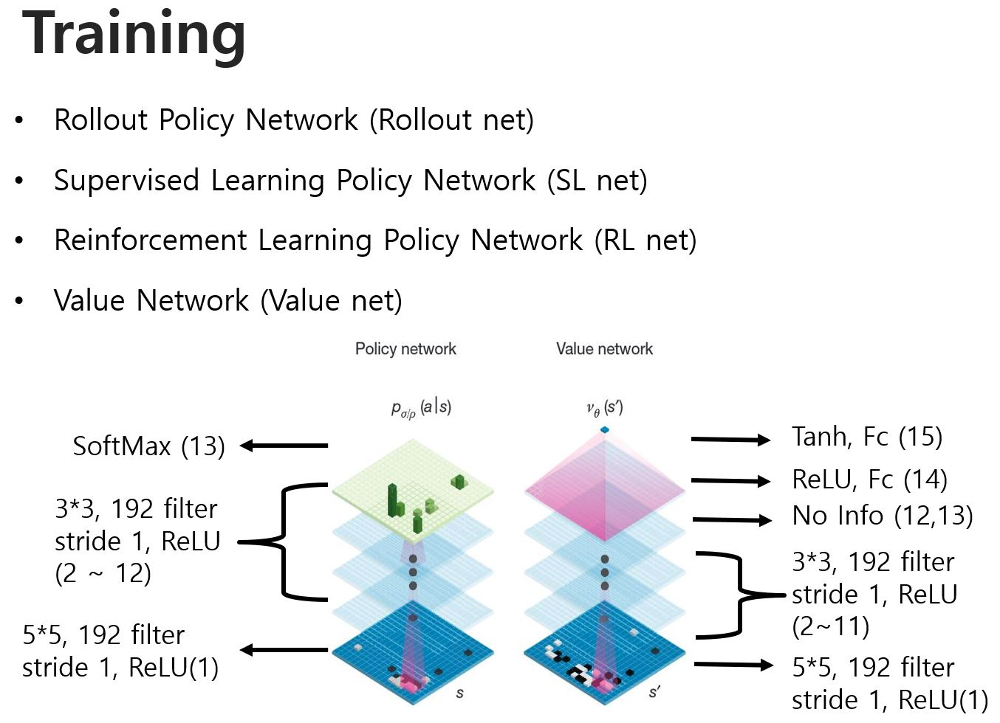

DeepMind에 대해 얘기하셨습니다.

Monte-Carlo Tree Search
- 두 사람이 게임을 한다고 가정했을 때
- 가능한 수를 차례대로 선택해 (Rollout)
- 이후 상대방과 나의 모든 수를 가정해서 (SL, Value(<- RL))
- 이길 가능성을 계산해 해당 수의 선택 확률을 계산하는 것?

1. Rollout policy & SL policy network: 인간이 둔 것을 학습
   1. 다음 수를 어디에 둬야할까를 고민
   2. Rollout policy는 많은 수를 내다보지 않을 때 이용
   3. SL policy network는 Rollout보단 더 먼 수를 내다볼 때 이용
2. RL policy network & Value network: 사람이 둔 수 + 알파고끼리 뒀을 때의 수를 학습
   1. 현재 판세를 읽음.
   2. RL policy network: value network를 학습할 때 이용
   3. Value network: 현재 판세를 평가 (모든 바둑알을 두지 않았지만, 졌다든지 어차피 질 것 같다든지를 평가)

- policy는 다음 수를 어디에 둬야 할까를 고민

### 본격적인 training

- 사람이 바둑판을 인식하는 features를 이용하니까 평가율이 올랐다고.
- 결과적으로 이기면 현재 판에 대한 gradient에 1로 곱하고, 지면 -1를 곱하게 함.
- 무엇이 가장 영향을 미쳤는지는 모르지만, 인간의 기보(한 게임에서 각 단계에서의 수)를 이용해서 overfitting이 발생
- 이 때문에? RL policy network를 이용한다고.
- Hadoop 개념을 이용한 alphago를 distributtion(?) alphago라고 하고, 빠르고 좀 더 정확한 결과를 낸다고.
