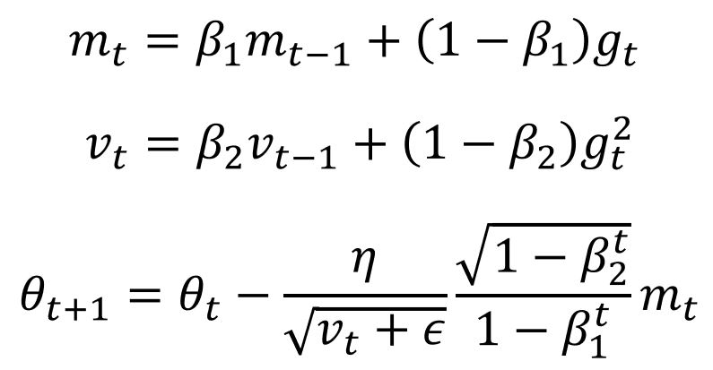

가장 기본 가정은 하나의 최적값이 존재하는 기울기(loss function의 미분)

1. Gradient Descent
   - 헤시안: 1차 편미분의 공간
   - Neuton Methods: 기울기와 가속도(결과적으로 2차 미분)를 이용하는 방법.
   1. Batch Gradient Descent
      - Batch 크기의 미분을 한 번에 고려한다.
      - 여기서 batch 크기라는 것은 training data를 의미하며, 모든 데이터에 대해 한 번만 계산함을 의미한다.
      - 각 기울기를 계산하고 (보통) 평균 내서 한 번 업데이트
   2. Stochastic Gradient Descent
      - 한 번에 하나의 데이터만 보는 것.
   3. Mini-batch Gradient Descent
      - 대체로 SGD는 Mini-batch를 이야기한다.
      - mini-batch만큼을 batch로 뽑아 Batch Gradient Descent의 방법을 이용해 업데이트
      - 대체로 GPU를 이용하면 2^n을 크기로 이용
      - mini-batch size가 작으면 학습 속도가 느리지만, 평가율은 올라간다고.
   - 결과적으로 learning rate을 잡기 어렵다. (logscale을 이용하면 그나마 괜춘)
   - 초깃값에 의한 local minima

<br />

2. Momentum
   - 대표적으로 loss contour가 찌그러진 타원일 때, 가중치 최적화가 중심을 제대로 찾지 못하고, 진동하는 것을 조금 보완.
   - ```Python, tf.train.MomentumOptimizer.__init__(learning_rate, momentum, use_locking=False, name="Momentum")```
   - Nesterov accelerated gradient (NAG)
     - momentum이 모멘텀으로 인한 반동과 현재 위치의 기울기를 내적해 움직여서 기울기 형태가 2차일 때 최적화 부분에서 계속 공 구르듯 반동을 잡지 못하고 움직이는 거라면,
     - 얘는 모멘텀의 반동만큼 이동하고 현재 위치의 기울기를 계산해 업데이트하는 방식이라 더 빠르게 최적값에서 멈춤.

<br />

#### Adaptive의 시작

3. Adagrad
   - 지금까지는 learning rate이 전체에 하나뿐이었는데, 각 가중치마다 다르게 적용할 순 없을까?
   - 많이 움직인 가중치는 작게, 적게 움직인 가중치는 크게 움직이게 하자.
   - <i>G<sub>t, ii</sub></i>: 지금까지 기울기의 제곱
   - ```Python tf.train.AdagradOptimizer.__init__(learning_rate, initial_accumulator_value=0.1, use_locking=False, name="Adagrad")```
   - 그러나 G의 값이 계속 커지면서 최적이 아닌 곳에서 멈추게 됨.

<br />

4. Adadelta
   - 그래서 exponential moving average의 개념을 이용합니다.
   - 따라서 지금까지의 기울기 제곱의 합(gamma를 이용해 일정 비율로 합침)과 현재 기울기의 변화량의 비율을 learning rate으로 취급

<br />

5. RMSprop (by Geoff Hinton)
   - Adadelta와 유사. Exponential Moving Average의 개념을 이용한다는 측면에선 같지만,
   - 얘는 전체 learning rate이 존재함.
   - 기울기 제곱의 총합의 기댓값과 현재 기울기 제곱을 적절히 섞어 Adagrad처럼 이용.

<br />

6. Adam (Adaptive Moment Estimation)
   - Momentum의 진화 단계지만, Ada 시리즈의 개념이 모두 들어감.
   - momentum을 조정하는 beta와 초기 기울기값을 돕는 epsilon이 중요한 매개변수
   - epsilon이 작으면 처음에 엄청 크게 움직이게 하니까.
   - 편향성을 없애고자 이용하는 beta에 대한 텀이 최종 계산에 이용됨.
  
   - 경험상 regression에선 epsilon을 10-4로 키우는 게 좋다고 하심.
   - ```Python tf.train.AdamOptimizer.__init__(learning_rate=0.001, beta1=0.9, beta2=0.999, epsilon=1e-08, use_locking=False, name="Adam")```

<br />

- Curriculum Learning: 조금 쉬운 데이터를 먼저 학습시키는 방법론.
- Batch Normalization
- Early stopping
- Gradient Noise: 기울기에 노이즈를 주면 학습이 빨라질 가능성이 있다.

loss에 대한 그림을 그려 확인하자.

- [ADAM: A METHOD FOR STOCHASTIC OPTIMIZATION](https://github.com/sjchoi86/dl_tutorials_10weeks/blob/master/papers/ADAM-%20A%20METHOD%20FOR%20STOCHASTIC%20OPTIMIZATION.pdf)
