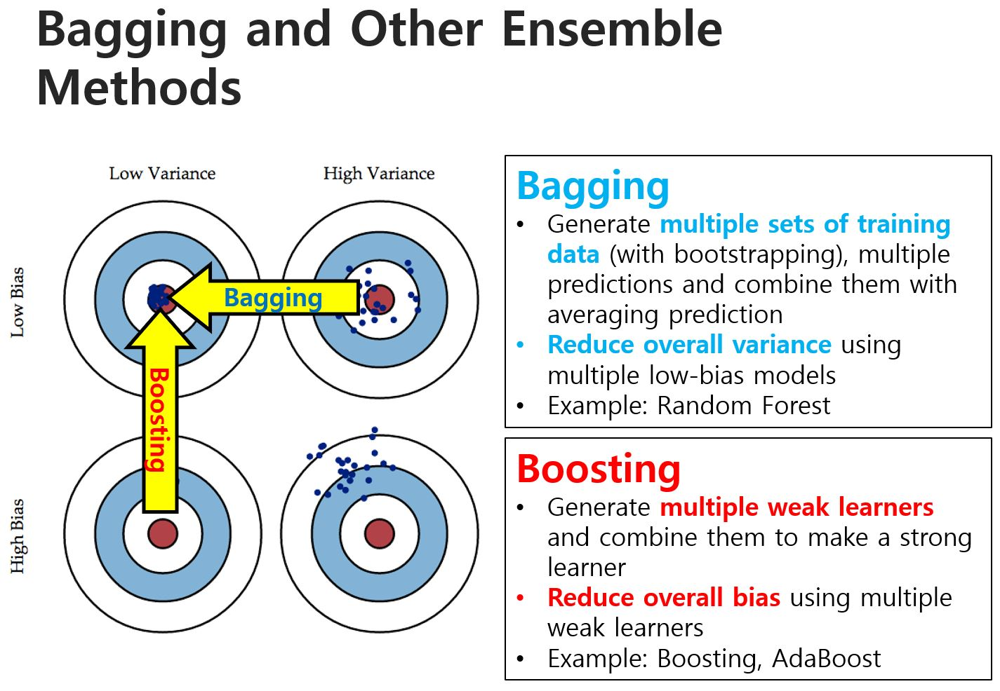

Regularization

- Overfitting을 막기 위해
  - training error는 당연히 줄을수록 좋은 것.
  - 그러나 너무 train 데이터에 의존해서 우리가 궁극적으로 원하는 test error를 줄이는 일을 제대로 시행하지 못하는 건 문제.
  - 통계의 연장선, 가장 완벽한 것은 알 수도, 찾을 수도 없다.
  - 딥러닝도 마찬가지, 딥하게 계층을 많이 이용한다고 무조건 정확도가 상승하는 건 아니다.
  - 결과적으로 노이즈 때문에 일어나는 일.

Generalization performance를 높이는 게 중요.

preventing overfitting

1. Get more data
2. Use a model with the capacity
   1. Architecture: 처음부터 모델을 적당히 구성
   2. Early stopping: 학습하다가 과대적합이 일어나는 듯하면 학습을 종료
   3. Weight-decay: 내가 일반적으로 아는 정규화 방법들. (또 the lasso는 언급하지 않으셨다)
3. Average many different models (Ensemble)
4. Use DropOut, DropConnect, or Batch Normalization
   1. DropOut이 일부 XW를 이용하지 않는(0으로 취급하는) 거라면
   2. DropConnect는 일부 W를 이용하지 않는(0으로 취급하는) 거라는 듯?
   3. BatchNorm: hyper-parameter 단위의 테크닉이 주는 머리아픔을 줄여줌.
      > (논문에선) Increase learning rate, Remove Dropout, Reduce L2 weight decay, Accelerate learning rate decay, Remove Local Response Normalization

결과적으로 딥러닝을 이용한다면 매번 overfitting을 발생한다고 판단할 수 있다. 
따라서 과대적합을 매 상황에서 고려해야 한다.

데이터가 적을수록 적당한, 매우 적당한 계층을 구성해야 한다.

Book review

1. Parameter Norm Penalties
   1. L2가 기본 regularization
   2. L1이 the lasso
2. Dataset Augmentation: real more data or 데이터 변형(돌리기, 노이즈 추가, 확대 등등)
3. Noise Robustness
   1. 계층 중간중간에 노이즈를 추가하는 게 노이즈에 덜 민감하게 할 수 있다.
   2. DropConnect처럼 가중치값 자체에도 노이즈를 추가하는 게 도움이 된다.
   3. Label-smoothing: 예를 들어 [1, 0, 0]을 [0.8, 0.1, 0.1]로 좀 더 유연하게 이용.
4. Semi-Supervised Learning: Supervised + Unsupervised
   1. CNN을 생각하면, filter 크기만큼의 대푯값을 연달아 찾는 건데, 이를 representation이라 할 수 있고,
   2. Unsupervised를 초반에 실시하면, 가중치에 대한 representation을 찾고 구성할 수 있다.
   3. 대표적으로 auto-encoding
   4. 어.. 마지막 말로는 Unsupervised를 통해 계층의 구조를 그리신 걸로 보입니다만?
5. Multi-Task Learning
   1. 한 번에 많은 문제를 해결하는 것. (나이 추정, 성별 추정, 직업 추정? 등을 한 번에)
   2. 서로 다른 문제를 통해서 공통적인 무언가를 찾아 추정.
   3. 여기서 찾는 공통적인 무언가가 4. Semi에서 얘기했던 representation이라고.
   4. shared architect 이용
6. Early Stopping
7. Parameter Tying and Parameter Sharing
   1. Tying: 다른 가중치와 값을 비슷하게 하는 것.
   2. Shaing: 다른 가중치와 같은 값을 이용하는 것. (대표적으로 CNN)
   3. 비슷한 작업을 하는 가중치 연산의 값을 동일하게 이용하므로써 가중치 줄임.
8. Sparse Representations: 전체적으로 연산 구성에서 0이 많길 원함.
   1. Sparse weights: 가중치에 0인 것이 많음.
   2. Sparse activations: 연산 이후, 활성화 함수를 값을 0으로 만듦. (대표적으로 ReLU)
9. Bagging and Other Ensemble Methods: 우리의 소원은 Low bias & variance
   1.  High Variance는 Bagging을 통해 해결할 수 있다. (Random Forest)
   2.  High Bias는 Boosting을 통해 해결할 수 있다. (각 모델에서의 loss도 학습하는 모델로 구성하는 것, AdaBoost)
      
10. Dropout
11. Adversarial Training
    1.  사람이 인식하기 굉장히 작은 (이상한) 노이즈를 이용해 input을 (조금) 변형시켰을 때, 다른 클래스로 예측함 (이런 현상, 데이터셋을 의미)
    2.  우리가 가진 모형의 기울기가 가파름을 의미 (과대적합의 기울기도 가파름)
    3.  그러나 굉장히 큰 input data를 이용했다면, 극히 일부의 경우의 수를 제외하면 모두 학습한 것이라 이때는 overfitting이 의심되지만, 크게 신경쓰지 않는다고.

- [Dropout: A Simple Way to Prevent Neural Networks from Overfitting](https://github.com/sjchoi86/dl_tutorials_10weeks/blob/master/papers/Dropout-%20A%20Simple%20Way%20to%20Prevent%20Neural%20Networks%20from%20Overfitting.pdf)
